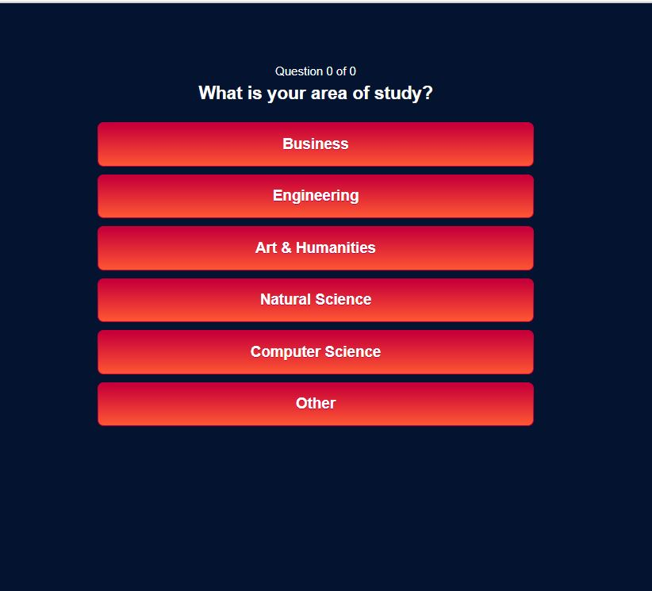

## Project-2

# Networking App

_Brought to you by:_
## Joke Laugh Make Friends

https://jlmf.herokuapp.com/

Recognizing that networking events are both necessary and painful, we sought to create an app that would make attending events more pleasant and productive.

This application allows the hosts of networking events the opportunity to register their events on the JLMF site. 
Event attendees will access the JLMF site to register for an event. At the time of registration, the attendee will be asked to complete a short survey. The responses from the survey will be used to group the attendee by similar backgrounds and interests.

Prior the start of the event the host will be notified, via the app, of the names of the attendees and the groups to which they belong. The host will be able to incorporate this information into the name badges, thereby allowing event participants to easily identify other attendees with similar backgrounds or interests. This information will create an environment where people are more comfortable approaching others and the connections, they make will be stronger.

This application utilizes the following NPM packages:

* Node
* Express
* MySQL
* Sequelize
* Express-Handlebars
* Faker

##  _Image 1:  Homepage-JLMF Networking_  

## _Image 2:  Login-JLMF Networking_

## _Image 3:  Survey Question Example-JLMF Networking_
